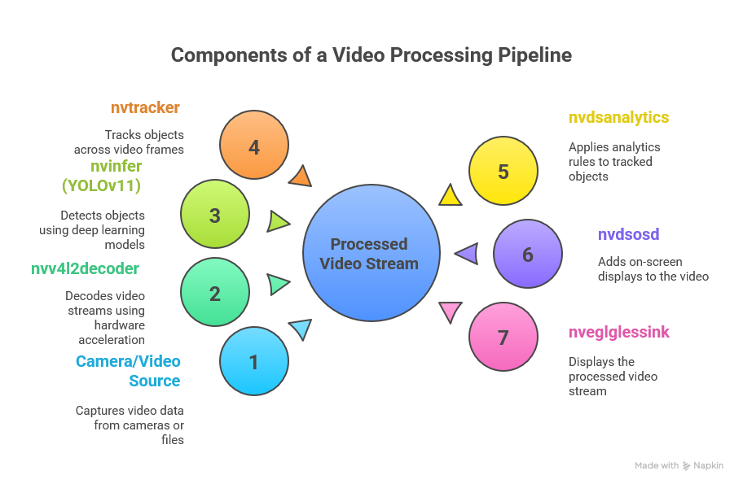

# 🛕 Smart Crowd Management for Pilgrimage Centers in Gujarat

## 📘 Project Overview
India’s rich spiritual heritage attracts millions of devotees and tourists every year. Gujarat is home to some of the most sacred and popular pilgrimage destinations such as **Somnath, Dwarka, Ambaji, and Pavagadh**. These sites witness massive footfalls, especially during **festivals, auspicious days, and long weekends**.  

While these pilgrim centers play a vital role in strengthening **cultural tourism**, they also face severe challenges in managing crowd surges, ensuring safety, providing timely information, and improving the overall devotee experience.

Incidents of overcrowding, long queues, health emergencies, and inefficient resource allocation highlight the **urgent need for a technology-driven crowd management solution** that can ensure safety, convenience, and a smooth spiritual experience for pilgrims.

---

## 🧭 Problem Statement
Currently, most pilgrimage centers rely on **manual monitoring**, **local police deployment**, and **traditional queue systems** for managing crowds. These methods often prove inadequate during peak seasons when lakhs of devotees gather simultaneously.

### ⚠️ Key Challenges
- **Overcrowding & Queue Management** — Long waiting times, lack of real-time queue visibility, and congestion at entry/exit points.  
- **Safety & Emergency Response** — High risk of stampedes, delayed medical response, and lack of early warning systems.  
- **Traffic & Mobility Challenges** — Congested approach roads, parking shortages, and poor vehicular coordination.  
- **Pilgrim Guidance & Communication** — Absence of digital platforms to relay real-time updates, temple timings, or emergency alerts.  
- **Resource Optimization** — No AI-based system to predict crowd peaks and optimize the deployment of police, volunteers, or medical teams.  
- **Inclusivity & Accessibility** — Limited facilities for the elderly, women, children, and differently-abled devotees.  

Without **integrated smart systems**, it becomes increasingly difficult to maintain the balance between **religious traditions, safety, and modern-day visitor expectations**.

---

## 🎯 Project Objective
To design and implement a **Smart AI-powered Crowd Management System** for pilgrimage centers that ensures:
- **Safety** of devotees through real-time monitoring and early warning mechanisms.  
- **Efficiency** in managing queues, traffic, and mobility.  
- **Accessibility** and inclusivity for all pilgrims.  
- **Enhanced Experience** by reducing waiting times and providing timely updates.  
- **Scalability** across different temple towns and pilgrimage centers in India.  

---

## 💡 Proposed Solution
Participants are expected to design **scalable**, **cost-effective**, and **user-friendly** technology solutions for smart crowd management.  
The system should integrate **AI, IoT, data analytics, and real-time communication** to predict, monitor, and manage crowd flow effectively.

### 🔍 Core Components

#### 1. 🧠 AI/ML-based Crowd Prediction Models
- Use historical data, festival calendars, and weather patterns to forecast visitor surges.
- Enable predictive deployment of staff, medical units, and security forces.

#### 2. 🎟️ Smart Queue & Ticketing Systems
- Implement **virtual queues** and **digital darshan passes** to minimize physical waiting lines.  
- Real-time updates on queue length, waiting time, and slot availability through **mobile apps and kiosks**.

#### 3. 📷 IoT & Surveillance Systems
- Deploy **CCTV cameras with AI-based crowd density analytics**.  
- Integrate **IoT sensors and drones** to monitor real-time crowd flow and detect congestion zones.  
- Automated alerts to authorities when thresholds are exceeded.

#### 4. 🚨 Emergency & Safety Management
- AI-enabled **panic detection** and **incident recognition** using video analytics.  
- Smart barricades that can be dynamically adjusted based on crowd density.  
- Automated alerts to **medical teams and first responders**.  
- Integration with **emergency mapping systems** for rapid assistance.

#### 5. 🚗 Traffic & Mobility Management
- Intelligent **parking guidance** and **navigation assistance**.  
- Real-time coordination of **shuttle/bus services** with temple authorities.  
- **Dynamic traffic control** integrated with local police command centers.

#### 6. 📱 Pilgrim Engagement & Information Platform
- A multilingual **mobile/web app** providing:
  - Real-time crowd status  
  - Temple timings  
  - Route guidance  
  - Facility information (rest areas, toilets, drinking water points)  
  - Emergency alerts and assistance contacts  

#### 7. ♿ Accessibility & Inclusivity
- **Voice-guided navigation** and **priority access** for elderly and differently-abled devotees.  
- Separate queue management and **special assistance zones**.
---

## ⚙️ System Architecture




Each block represents a **DeepStream plugin** that performs a specific role:
- `nvinfer`: runs YOLOv11 for object detection.
- `nvtracker`: assigns tracking IDs.
- `nvdsanalytics`: defines ROI and line-crossing zones.
- `nvdsosd`: overlays results on screen.

---

## 🧰 Prerequisites

Before running this project, make sure you have:

### ✅ Hardware
- NVIDIA GPU (dGPU or Jetson platform)
- Minimum 4 GB VRAM

### ✅ Software
| Component | Version |
|------------|----------|
| Ubuntu | 22.04 |
| Python | ≥ 3.10 |
| NVIDIA Drivers | Compatible with CUDA 12+ |
| CUDA Toolkit | 12.x |
| DeepStream SDK | ≥ 7.1 |
| TensorRT | Included with DeepStream |
| PyDS | Properly built & installed |

---

## 🚀 How to Use
🧩 Step 1: Clone or Copy the Repository
```
git clone https://github.com/mithunbs05/Crowd-Management.git
```

Step 2: Access it from DashBoard

---

### 🧩 Future Enhancements

- Add multiple camera stream support
- Save data to CSV / Database
- Add a web dashboard for real-time analytics
- Integrate MQTT or Kafka for IoT deployment
- Implement heatmap generation for movement analysis

### 🧩 Summary

This project demonstrates the integration of YOLOv11 and DeepStream SDK for edge-level, real-time people counting.
It’s a strong foundation for developing smart surveillance and analytics systems that combine deep learning with GPU-accelerated inference.
